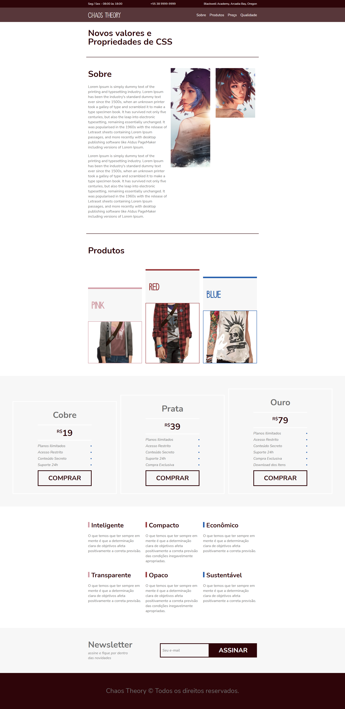

# Chaos Theory

## 📝 Sobre

**Chaos Theory** é um projeto simples criado para testar propriedades do flexbox, inspirado no projeto **Flexblog** do curso da origamid.

---------
---------

## 🖥️ Demonstração
  

## >>**[Clique aqui para acessar a demonstração do website](https://rodrigofonsecag.github.io/chaostheory/)**<<

----------
----------

## 🚀 Tecnologias e ferramentas utilizadas

- **HTML5**
- **CSS3**

----
----

## 📝 Licença

O projeto está sob a licença MIT. Para saber mais, acesse o arquivo [LICENSE](https://github.com/RodrigoFonsecaG/bikcraft/blob/main/LICENSE).

---

**Desenvolvido por [Rodrigo Fonseca](https://github.com/RodrigoFonsecaG/).**
